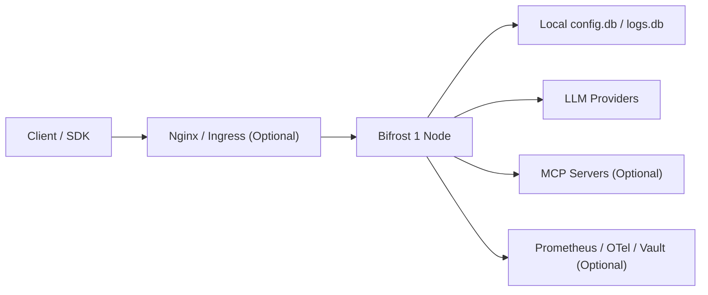
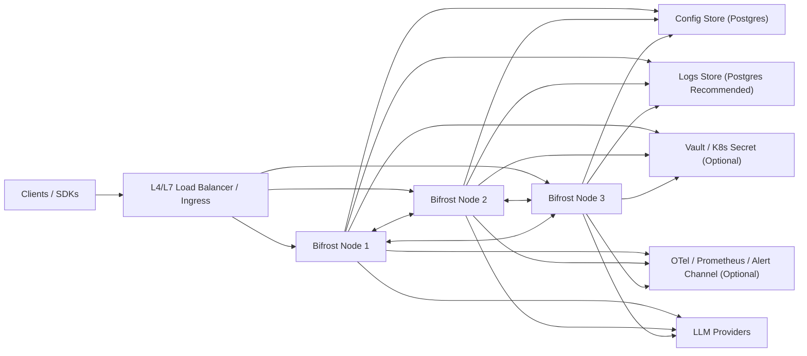

# Bifrost 部署指引

本文档面向这个 fork 的当前实现，给出单机版与集群版的可落地部署方案，并明确说明现阶段集群能力的真实边界。

## 1. 架构审视结论

### 1.1 单机版

单机版已经可以稳定支撑生产使用，尤其适合：

- 中小规模团队
- 单区域部署
- 对控制面高可用要求不高，但对推理吞吐和统一网关能力要求高
- 希望先以最少中间件上线，再逐步演进到多节点

当前单机版的优点：

- 启动简单，默认即可落到本地 `config.db` 和 `logs.db`
- 配置、日志、MCP、治理、插件、Dashboard 都能完整工作
- 对外只需要暴露一个 HTTP 端口
- 性能路径仍然保持在现有 Bifrost 的高性能模型上

### 1.2 集群版

当前代码已经可以支撑“生产可用的高可用多节点部署”，但我不会把它描述成“已经完美等同官网描述的完整 gossip 集群”。

更准确的定义是：

- 已支持：多节点高可用、节点发现、健康探测、配置传播、核心治理对象传播、KV 复制、会话同步、部分集群聚合观测
- 未完全支持：独立 gossip 数据平面、全量 discovery 后端、断联节点的自动补账式回放、全局统一的跨节点 primary provider 决策

### 1.3 当前集群实现的真实边界

当前集群能力可以安全用于生产，但你需要知道这些边界：

1. 集群内部同步当前走的是 HTTP 内部端点，不是独立 gossip socket。
   也就是说，`/_cluster/*` 内部同步流量仍然走 Bifrost 主 HTTP 端口。

2. `cluster_config.discovery.type` 在 schema 中列了 `kubernetes / dns / udp / consul / etcd / mdns`，但运行时当前只实现了：
   - `kubernetes`
   - `dns`

3. `cluster_config.gossip.port` 和 `discovery.bind_port` 目前不能当成“独立 cluster port”来理解。
   当前实现里，如果你把它们设成和 Bifrost HTTP 服务端口不同的值，discovery 得到的 peer 地址可能会指向一个实际上没有监听的端口。
   所以现阶段建议：
   - 要么不显式设置 `gossip.port` / `discovery.bind_port`
   - 要么把它们和实际 HTTP 服务端口保持一致

4. 配置同步是“变更时 fanout”，不是“持久消息队列回放”。
   如果某个节点在变更瞬间不可达，它可能会错过这次热更新。
   这就是为什么集群部署强烈建议使用共享 `config_store`，并配合 `Cluster Config` 页面观察 drift。

5. 当前已经纳入自动同步的核心范围是：
   - `client`
   - `auth`
   - `framework`
   - `proxy`
   - `provider`
   - `provider governance`
   - `mcp client`
   - `oauth state`
   - `dashboard session`
   - `built-in plugins`
   - `customer`
   - `team`
   - `virtual key`
   - `model config`
   - `routing rule`
   - `prompt repo` 的 `folder / prompt / version / session`

6. 还没有完整并入集群自动同步或完整企业闭环的主要方向：
   - 独立 gossip/shared-state 平面
   - `consul / etcd / udp / mdns` discovery
   - AWS / GCP / Azure secret manager runtime sync
   - RBAC 后端与 MCP with Federated Auth 的完整运行面
   - 跨节点统一 primary provider 决策

### 1.4 推荐结论

- 如果你要今天上线，单机版完全可用。
- 如果你要高可用，当前集群版可用，但建议按“共享 Postgres + 3 节点 + 内网同步 + drift 观测”的方式部署。
- 如果你要的是“任何节点短暂断联后也能自动无损补账”，当前实现还不算完美，需要继续往 shared-state/gossip 方向演进。

## 2. 部署模式选择

| 模式 | 适用场景 | 推荐存储 | 推荐节点数 |
| --- | --- | --- | --- |
| 单机版 | 开发、测试、小中型生产 | 默认 SQLite 或 Postgres | 1 |
| 集群版 | 生产高可用、滚动升级、控制面多节点 | 强烈建议 Postgres | 3 起步 |

建议：

- 单机版优先把功能跑通，再演进到集群版
- 集群版优先选择 3 节点，不建议 2 节点
- 集群版不要把 SQLite 当共享控制面使用

## 3. 部署架构

### 3.1 单机版推荐架构



### 3.2 集群版推荐架构



## 4. 外围中间件与基础设施建议

### 4.1 负载均衡 / Ingress

生产推荐放在 Bifrost 前面的组件：

- Nginx / HAProxy / Envoy / 云厂商 ALB/NLB / Kubernetes Ingress

建议职责：

- TLS 终止
- 健康检查转发到 `/health`
- 会话和 Dashboard 流量正常转发 WebSocket
- 不要把 `/_cluster/*` 暴露到公网

### 4.2 存储

#### 单机

- 默认可直接使用本地 SQLite：
  - `config.db`
  - `logs.db`

#### 集群

强烈建议：

- `config_store` 使用 Postgres
- `logs_store` 使用 Postgres

原因：

- 节点重启后可以从共享存储恢复最新配置
- 避免多节点各自持有完全独立的本地 SQLite 状态
- 集群页面中的 config drift 更有意义
- 日志、异步任务、审计查询更适合集中存储

注意：

- 当前 `logs_store` 的 Postgres 实现要求 PostgreSQL 16+
- 日志保留天数当前应配置在 `client.log_retention_days`，而不是 `logs_store.retention_days`
- 集群虽有配置 fanout，但它不是 durable queue，不建议依赖“仅靠节点间广播”作为唯一一致性手段

### 4.3 Secret 管理

当前支持的 runtime secret sync：

- HashiCorp Vault
- Kubernetes Secret

当前暂不建议在本 fork 中依赖为“已落地”的：

- AWS Secrets Manager
- Google Secret Manager
- Azure Key Vault

### 4.4 观测与告警

建议至少接入其中一类：

- Prometheus `/metrics`
- OpenTelemetry / OTel Collector
- Email / Feishu / Webhook 告警

### 4.5 日志导出存储

当前 `log_exports.storage_path` 是文件路径。

部署建议：

- 单机：本地持久卷即可
- 集群：每个节点都要有自己的持久卷，或者你自己提供共享 POSIX 文件系统

要特别注意：

- 当前导出文件是“源节点本地文件”
- 不要把它误当成已经做成了集群统一对象存储

## 5. 启动参数与环境变量

## 5.1 程序固定识别的启动参数

直接运行二进制时：

```bash
./bifrost-http -app-dir /data/bifrost -host 0.0.0.0 -port 8080 -log-level info -log-style json
```

固定参数：

| 参数 | 说明 | 默认值 |
| --- | --- | --- |
| `-app-dir` | 数据目录，包含 `config.json`、`config.db`、`logs.db` | OS 默认目录 |
| `-host` | 服务监听地址 | `localhost` |
| `-port` | 服务监听端口 | `8080` |
| `-log-level` | `debug/info/warn/error` | `info` |
| `-log-style` | `json` 或 `pretty` | `json` |

## 5.2 容器启动时的固定环境变量

Docker 镜像入口脚本会读取：

| 环境变量 | 说明 |
| --- | --- |
| `APP_PORT` | 容器内 Bifrost 端口 |
| `APP_HOST` | 容器内监听地址 |
| `APP_DIR` | 容器数据目录 |
| `LOG_LEVEL` | 日志级别 |
| `LOG_STYLE` | 日志格式 |
| `BIFROST_HOST` | 若未显式传 `-host`，可作为 host 默认值 |
| `GOGC` | Go GC 调优 |
| `GOMEMLIMIT` | Go 运行时内存软限制 |
| `BIFROST_ENCRYPTION_KEY` | 顶层 `encryption_key` 的环境变量来源 |

## 5.3 推荐使用的 `config.json` 环境变量引用方式

Bifrost 支持在 `config.json` 中直接写：

```json
{
  "value": "env.OPENAI_API_KEY"
}
```

或者直接：

```json
{
  "auth_token": "env.BIFROST_CLUSTER_AUTH_TOKEN"
}
```

建议约定这些环境变量名：

| 环境变量 | 用途 |
| --- | --- |
| `BIFROST_ENCRYPTION_KEY` | 加密密钥 |
| `OPENAI_API_KEY` | OpenAI provider key |
| `ANTHROPIC_API_KEY` | Anthropic provider key |
| `MISTRAL_API_KEY` | Mistral provider key |
| `BIFROST_PG_HOST` | Postgres host |
| `BIFROST_PG_PORT` | Postgres port |
| `BIFROST_PG_USER` | Postgres user |
| `BIFROST_PG_PASSWORD` | Postgres password |
| `BIFROST_PG_DB` | Postgres database |
| `BIFROST_PG_SSLMODE` | Postgres SSL 模式 |
| `BIFROST_CLUSTER_AUTH_TOKEN` | 集群节点间认证 token |
| `BIFROST_AUDIT_HMAC_KEY` | 审计日志 HMAC key |
| `BIFROST_VAULT_TOKEN` | HashiCorp Vault token |
| `BIFROST_SMTP_USERNAME` | 邮件告警用户名 |
| `BIFROST_SMTP_PASSWORD` | 邮件告警密码 |
| `BIFROST_FEISHU_WEBHOOK_URL` | 飞书告警 webhook |
| `BIFROST_FEISHU_SECRET` | 飞书签名 secret |
| `BIFROST_ALERT_WEBHOOK_URL` | 通用 webhook 告警地址 |

说明：

- 除少数固定环境变量外，大部分名字只是推荐约定，不是框架强制固定
- `config.json` 里写成 `env.<NAME>` 才会去读对应环境变量

## 5.4 自动识别的 provider 环境变量

在没有 `config.json` provider 配置时，当前会自动识别：

- `OPENAI_API_KEY` / `OPENAI_KEY`
- `ANTHROPIC_API_KEY` / `ANTHROPIC_KEY`
- `MISTRAL_API_KEY` / `MISTRAL_KEY`

但生产环境仍然建议显式写 `config.json`，不要依赖自动探测。

## 6. 单机版部署

## 6.1 最小部署建议

适合：

- 开发环境
- 演示环境
- 小流量生产

推荐：

- 1 个 Bifrost 节点
- 本地卷持久化 `/app/data`
- 必要时再接 Nginx/Ingress

## 6.2 单机版最小 `config.json`

```json
{
  "$schema": "https://www.getbifrost.ai/schema",
  "encryption_key": "env.BIFROST_ENCRYPTION_KEY",
  "client": {
    "enable_logging": true,
    "disable_content_logging": true,
    "log_retention_days": 30,
    "allowed_origins": ["*"],
    "max_request_body_size_mb": 100
  },
  "providers": {
    "openai": {
      "keys": [
        {
          "name": "openai-primary",
          "value": "env.OPENAI_API_KEY",
          "models": ["gpt-4o", "gpt-4o-mini"],
          "weight": 1
        }
      ]
    }
  }
}
```

说明：

- 不写 `config_store` / `logs_store` 时，默认会在 `APP_DIR` 下创建 SQLite
- 这是最适合先起服务的方式

## 6.3 Docker 单机版示例

```bash
docker run -d \
  --name bifrost \
  -p 8080:8080 \
  -v $(pwd)/data:/app/data \
  -e APP_HOST=0.0.0.0 \
  -e APP_PORT=8080 \
  -e APP_DIR=/app/data \
  -e LOG_LEVEL=info \
  -e LOG_STYLE=json \
  -e GOGC=200 \
  -e GOMEMLIMIT=1800MiB \
  -e BIFROST_ENCRYPTION_KEY='replace-with-strong-passphrase' \
  -e OPENAI_API_KEY='replace-with-openai-key' \
  maximhq/bifrost:latest
```

## 6.4 二进制单机版示例

```bash
export BIFROST_ENCRYPTION_KEY='replace-with-strong-passphrase'
export OPENAI_API_KEY='replace-with-openai-key'

./bifrost-http \
  -app-dir ./data \
  -host 0.0.0.0 \
  -port 8080 \
  -log-level info \
  -log-style json
```

## 6.5 单机版验证

```bash
curl http://127.0.0.1:8080/health
curl http://127.0.0.1:8080/api/config
curl http://127.0.0.1:8080/api/providers
```

期望：

- `/health` 返回 `200`
- Dashboard 可以打开
- provider 列表可读

## 7. 集群版部署

## 7.1 推荐拓扑

最少推荐：

- 3 个 Bifrost 节点
- 1 个外部负载均衡入口
- 1 套共享 Postgres
- 1 套内网互通的节点网络

推荐原因：

- 1 节点没有高可用
- 2 节点容易把故障处理和脑裂判断做得很尴尬
- 3 节点是当前最稳妥的生产起点

## 7.2 集群部署前提

集群版要满足这些前提：

1. 所有节点运行同一版本二进制
2. 所有节点使用同一份 `encryption_key`
3. 所有节点都能通过内网直接访问其他节点的 Bifrost HTTP 端口
4. 所有节点都配置同一个 `cluster_config.auth_token`
5. 外部流量走负载均衡；内部同步不要走公网
6. 推荐所有节点都连同一个 `config_store` 和 `logs_store`

## 7.3 集群版非常重要的注意事项

### 不要把 LB 地址填进 `cluster_config.peers`

`cluster_config.peers` 应该写节点间可以直连的地址，例如：

- `http://bifrost-1.internal:8080`
- `http://bifrost-2.internal:8080`
- `http://bifrost-3.internal:8080`

不要写：

- 公网负载均衡域名
- 只对客户端可见、不能回到单节点的统一入口地址

### 不要把 `gossip.port` / `discovery.bind_port` 配成一个“额外端口”再指望它自己生效

当前实现内部同步走主 HTTP 服务端口，所以请遵守：

- 最安全：不写 `gossip`，也不写 `discovery.bind_port`
- 如果你必须写 `discovery.bind_port`，就把它写成实际 HTTP 端口，例如 `8080`

### 集群不是消息队列

当前配置传播是 fanout 模式：

- 节点 A 改配置
- A 广播给其它节点
- peer 在线就热生效
- peer 当时不在线，就可能错过这次变更

所以生产推荐：

- 共享 Postgres 作为持久控制面
- 运维侧盯住 `Cluster Config` 页面 drift
- 节点长期失联后恢复时，建议做一次健康检查和必要的滚动重启

## 7.4 集群版推荐 `config.json` 模板

这是 VM / Docker / K8s 都适用的通用模板：

```json
{
  "$schema": "https://www.getbifrost.ai/schema",
  "encryption_key": "env.BIFROST_ENCRYPTION_KEY",
  "client": {
    "enable_logging": true,
    "disable_content_logging": true,
    "log_retention_days": 30,
    "allowed_origins": [
      "https://gateway.company.com"
    ],
    "allowed_headers": [
      "Authorization",
      "Content-Type"
    ],
    "max_request_body_size_mb": 100,
    "mcp_agent_depth": 10,
    "mcp_tool_execution_timeout": 30
  },
  "config_store": {
    "enabled": true,
    "type": "postgres",
    "config": {
      "host": "env.BIFROST_PG_HOST",
      "port": "env.BIFROST_PG_PORT",
      "user": "env.BIFROST_PG_USER",
      "password": "env.BIFROST_PG_PASSWORD",
      "db_name": "env.BIFROST_PG_DB",
      "ssl_mode": "env.BIFROST_PG_SSLMODE",
      "max_idle_conns": 10,
      "max_open_conns": 50
    }
  },
  "logs_store": {
    "enabled": true,
    "type": "postgres",
    "config": {
      "host": "env.BIFROST_PG_HOST",
      "port": "env.BIFROST_PG_PORT",
      "user": "env.BIFROST_PG_USER",
      "password": "env.BIFROST_PG_PASSWORD",
      "db_name": "env.BIFROST_PG_DB",
      "ssl_mode": "env.BIFROST_PG_SSLMODE",
      "max_idle_conns": 10,
      "max_open_conns": 50
    }
  },
  "cluster_config": {
    "enabled": true,
    "auth_token": "env.BIFROST_CLUSTER_AUTH_TOKEN",
    "peers": [
      "http://bifrost-1.internal:8080",
      "http://bifrost-2.internal:8080",
      "http://bifrost-3.internal:8080"
    ]
  },
  "load_balancer_config": {
    "enabled": true
  },
  "audit_logs": {
    "disabled": false,
    "hmac_key": "env.BIFROST_AUDIT_HMAC_KEY",
    "retention_days": 180
  },
  "log_exports": {
    "enabled": true,
    "storage_path": "/app/data/exports",
    "format": "jsonl",
    "compression": "gzip",
    "max_rows_per_file": 50000,
    "flush_interval_seconds": 60
  },
  "providers": {
    "openai": {
      "network_config": {
        "max_conns_per_host": 5000
      },
      "keys": [
        {
          "name": "openai-primary",
          "value": "env.OPENAI_API_KEY",
          "models": ["gpt-4o", "gpt-4o-mini"],
          "weight": 1
        }
      ]
    }
  }
}
```

## 7.5 Kubernetes 集群配置示例

当前如果你用 K8s discovery，推荐写法：

```json
{
  "$schema": "https://www.getbifrost.ai/schema",
  "encryption_key": "env.BIFROST_ENCRYPTION_KEY",
  "config_store": {
    "enabled": true,
    "type": "postgres",
    "config": {
      "host": "env.BIFROST_PG_HOST",
      "port": "env.BIFROST_PG_PORT",
      "user": "env.BIFROST_PG_USER",
      "password": "env.BIFROST_PG_PASSWORD",
      "db_name": "env.BIFROST_PG_DB",
      "ssl_mode": "env.BIFROST_PG_SSLMODE"
    }
  },
  "logs_store": {
    "enabled": true,
    "type": "postgres",
    "config": {
      "host": "env.BIFROST_PG_HOST",
      "port": "env.BIFROST_PG_PORT",
      "user": "env.BIFROST_PG_USER",
      "password": "env.BIFROST_PG_PASSWORD",
      "db_name": "env.BIFROST_PG_DB",
      "ssl_mode": "env.BIFROST_PG_SSLMODE"
    }
  },
  "cluster_config": {
    "enabled": true,
    "auth_token": "env.BIFROST_CLUSTER_AUTH_TOKEN",
    "discovery": {
      "enabled": true,
      "type": "kubernetes",
      "service_name": "bifrost",
      "k8s_namespace": "ai-gateway",
      "k8s_label_selector": "app=bifrost"
    }
  },
  "providers": {
    "openai": {
      "keys": [
        {
          "name": "openai-primary",
          "value": "env.OPENAI_API_KEY",
          "models": ["gpt-4o", "gpt-4o-mini"],
          "weight": 1
        }
      ]
    }
  }
}
```

K8s 侧建议：

- `Deployment` 或 `StatefulSet` 至少 3 副本
- Headless Service 供 discovery 使用
- 对外再放一个普通 Service / Ingress
- `APP_HOST=0.0.0.0`
- Readiness / Liveness 都打 `/health`

额外说明：

- 当前 `kubernetes discovery` 的运行方式本质上还是 DNS 解析，因此一定要让 `service_name.namespace.svc` 解析到各个 Pod IP，而不是普通 `ClusterIP Service` 的单个 VIP
- 最稳的方式是给 cluster discovery 单独准备一个 Headless Service，比如 `bifrost-peer`
- 对外流量再走另一个普通 Service / Ingress，比如 `bifrost-public`
- `k8s_label_selector` 字段目前还没有参与运行时 discovery 解析，当前真正生效的是 `service_name + k8s_namespace`
- discovery 默认会周期刷新，不需要因为新增 Pod 而重启全部旧 Pod；当前默认刷新周期通常是 5 秒

### 7.5.1 Kubernetes 常见问题

#### 是否需要为了每个 Pod 单独写环境变量或改代码

不需要。

推荐方式是：

- 所有 Pod 使用同一份 `config.json`
- 所有 Pod 使用同一个 `cluster_config.auth_token`
- 所有 Pod 共用同一个 `config_store`
- 通过 `cluster_config.discovery` 自动发现 peer

这意味着你不需要把每个 Pod 的 IP 写进环境变量，也不需要因为扩容去改应用代码。

#### 当前 Pod 会不会把自己也当成 peer

正常情况下不会。

当前实现会把本节点的这些地址加入 self 集合并过滤掉：

- 启动时使用的 `host:port`
- `127.0.0.1:<port>`
- `localhost:<port>`
- `::1:<port>`
- 当前 Pod 网卡上的各个 IP 加当前监听端口

因此只要 discovery 解析出来的是“当前 Pod 实际 IP + 正确端口”，它通常会正确跳过自己。

#### 使用 Headless Service 后，会不会覆盖到所有 Pod

会，但更准确地说不是 “通知 Service”，而是：

1. 每个节点会周期性解析 `service_name.namespace.svc`
2. 解析结果如果是 Headless Service，通常会得到一组 Pod IP
3. 每个节点会把这些 Pod IP 作为 peer 集合
4. 后续配置变更会 fanout 到当前 peer 集合里的所有节点

所以在 K8s 场景里，真正生效的是 “DNS 解析出来的 Pod 列表”，不是 Service 自己做广播。

#### 新增 Pod 后，旧 Pod 要不要全部重启

如果你用的是 `discovery`，通常不需要。

旧 Pod 会在 discovery 刷新周期内自动发现新 Pod，然后后续变更会自动传播给它。当前默认刷新通常是 5 秒左右。

但要注意：

- 新节点更适合依赖共享 `config_store` 恢复现有持久化配置
- 当前 fanout 不是 durable queue，所以它只能保证“加入之后的新变更”自动传播
- 因此生产上仍然强烈建议所有节点共用 Postgres `config_store`

#### `k8s_label_selector` 现在是否已经生效

还没有完全生效。

当前运行时 discovery 真正使用的是：

- `service_name`
- `k8s_namespace`

所以当前不要把 `k8s_label_selector` 当作主要发现手段。

### 7.5.2 Kubernetes Service 推荐拆分

推荐拆成两个 Service：

- `bifrost-peer`
  只给集群节点间发现和内部同步使用，必须是 Headless Service
- `bifrost-public`
  只给外部流量、Ingress 或网关入口使用，可以是普通 `ClusterIP` / `LoadBalancer`

最小示例：

```yaml
apiVersion: v1
kind: Service
metadata:
  name: bifrost-peer
  namespace: ai-gateway
spec:
  clusterIP: None
  publishNotReadyAddresses: false
  selector:
    app: bifrost
  ports:
    - name: http
      port: 8080
      targetPort: 8080
---
apiVersion: v1
kind: Service
metadata:
  name: bifrost-public
  namespace: ai-gateway
spec:
  type: ClusterIP
  selector:
    app: bifrost
  ports:
    - name: http
      port: 80
      targetPort: 8080
```

对应的 cluster 配置建议：

```json
{
  "cluster_config": {
    "enabled": true,
    "auth_token": "env.BIFROST_CLUSTER_AUTH_TOKEN",
    "discovery": {
      "enabled": true,
      "type": "kubernetes",
      "service_name": "bifrost-peer",
      "k8s_namespace": "ai-gateway"
    }
  }
}
```

推荐做法：

- `APP_HOST=0.0.0.0`
- 不额外设置 `cluster_config.peers`
- 不把 Ingress、LB 地址写进 `cluster_config.peers`
- 不把 `gossip.port` / `discovery.bind_port` 配成和实际 HTTP 监听端口不同的值

## 7.6 Docker Compose / VM 静态 peers 示例

外层用 HAProxy 或 Nginx，节点间配置静态 peers。

示例思路：

- `haproxy -> bifrost-1:8080`
- `haproxy -> bifrost-2:8080`
- `haproxy -> bifrost-3:8080`
- 每个节点 `cluster_config.peers` 都列出另外几个节点的内网地址

静态 peers 的特点：

- 适合固定 3 节点或 VM 场景
- 新增节点时，通常需要把新节点地址加入旧节点配置后再做滚动重启，才能让旧节点主动向它传播集群变更
- 因此在 K8s 场景里，不建议长期依赖静态 peers 维护扩缩容

HAProxy 最小示例：

```haproxy
frontend bifrost_front
    bind *:80
    default_backend bifrost_nodes

backend bifrost_nodes
    option httpchk GET /health
    server bifrost1 10.0.1.11:8080 check
    server bifrost2 10.0.1.12:8080 check
    server bifrost3 10.0.1.13:8080 check
```

## 7.7 集群版推荐环境变量

```bash
export BIFROST_ENCRYPTION_KEY='replace-with-strong-passphrase'
export BIFROST_CLUSTER_AUTH_TOKEN='replace-with-random-shared-token'

export BIFROST_PG_HOST='postgres.internal'
export BIFROST_PG_PORT='5432'
export BIFROST_PG_USER='bifrost'
export BIFROST_PG_PASSWORD='replace-with-password'
export BIFROST_PG_DB='bifrost'
export BIFROST_PG_SSLMODE='require'

export OPENAI_API_KEY='replace-with-openai-key'
export BIFROST_AUDIT_HMAC_KEY='replace-with-32-byte-minimum-secret'
```

如果启用 Vault：

```bash
export BIFROST_VAULT_TOKEN='replace-with-vault-token'
```

如果启用邮件告警：

```bash
export BIFROST_SMTP_USERNAME='smtp-user'
export BIFROST_SMTP_PASSWORD='smtp-password'
```

## 7.8 集群版验证步骤

### 节点连通性

```bash
curl http://node-1:8080/health
curl http://node-2:8080/health
curl http://node-3:8080/health
```

### 集群状态

```bash
curl http://node-1:8080/api/cluster/status
```

重点观察：

- `healthy`
- `peers[].healthy`
- `peers[].last_error`
- `config_sync.in_sync`
- `config_sync.drift_domains`

### 配置传播

1. 在节点 A 的 Dashboard 或 API 更新一个 provider / routing rule / virtual key
2. 在节点 B 打开 `Cluster Mode` 页面或 `GET /api/cluster/status`
3. 确认：
   - peer 正常
   - drift 消失或保持 in-sync
   - 对应页面自动刷新

### Session / Dashboard 高可用

1. 浏览器先登录 Dashboard
2. 经由 LB 多次刷新页面
3. 再打开实时日志或 cluster 页面
4. 确认登录态和 WebSocket 没有因节点切换中断

## 8. 生产参数建议

### 8.1 容器资源

建议起步：

| 负载级别 | CPU | 内存 |
| --- | --- | --- |
| 小流量 | 1-2 vCPU | 512MiB-1GiB |
| 中流量 | 2-4 vCPU | 1-2GiB |
| 高流量 | 4-8 vCPU | 2-4GiB |

### 8.2 Go 运行时

建议：

- `GOGC=200`
- `GOMEMLIMIT` 设成容器内存上限的约 90%

例如 2GiB 容器：

```bash
export GOGC=200
export GOMEMLIMIT=1800MiB
```

### 8.3 文件句柄

高并发建议把 `nofile` 提到至少：

- `16384` 起步
- 大流量建议 `65536`

### 8.4 Provider 网络参数

重点关注：

- `providers.<name>.network_config.max_conns_per_host`
- `providers.<name>.concurrency_and_buffer_size`
- `client.drop_excess_requests`

如果你是高并发生产，建议按真实 provider 吞吐做压测后再调。

## 9. 当前不建议的部署方式

### 9.1 集群 + 每节点本地 SQLite + 依赖热同步当作唯一真相源

原因：

- 节点短暂离线会错过某次 fanout
- 恢复后不会自动做 durable replay
- drift 只能被观测，不能完全自动补账

### 9.2 把 `/_cluster/*` 直接暴露到公网

原因：

- 这些接口是内部同步面
- 即便已经有 `X-Bifrost-Cluster-Token`，仍然应该只允许内网访问

### 9.3 把 `gossip.port` 当成当前版本的独立同步端口

原因：

- 当前实现没有单独 cluster listener
- 内部同步仍在 HTTP 主端口上

## 10. 推荐上线检查清单

- 所有节点二进制版本一致
- 所有节点 `encryption_key` 一致
- 所有节点 `cluster_config.auth_token` 一致
- 所有节点都能互相访问内网 HTTP 端口
- `/_cluster/*` 没有被公网暴露
- 集群版使用共享 Postgres
- `/health` 健康检查已接入 LB / Ingress
- `Cluster Mode` 页面可看到所有 peer
- 关键 provider / governance 变更可以跨节点生效
- Dashboard 登录态和 WebSocket 跨节点正常
- 如启用告警 / Vault / 审计 / 导出，对应状态页能正常返回

## 11. 最终建议

如果你的目标是“今天稳定上线”：

- 单机版：直接上
- 集群版：按 `3 节点 + Postgres + 内网 peers + cluster auth token + /health 健康检查` 的基线方案上

如果你的目标是“完全体企业级共享状态平面”：

- 当前实现已经足够做高可用 AI Gateway
- 但还不应该把它当成“已经彻底补完了完整 gossip/补账/全 discovery 后端”的终态
- 生产中要配合 drift 观测、共享存储和运维策略一起使用
